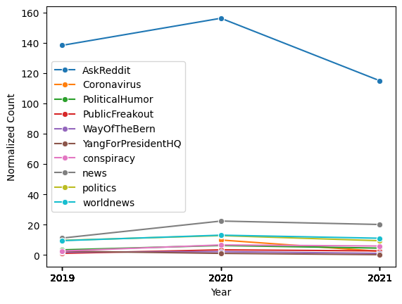
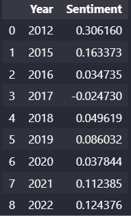

## Deplatforming Dilemma: Unraveling the Shift in Online Polarization After Reddit’s Intervention

### Abstract
Social media forums and discussion boards allow for users to share and discuss a variety of events ranging from politics to entertainment. However, there has been a rising concern over the possibility of echo chambers within these platforms which polarize their audiences. Many have opinions on how polarization should be handled, and one popular opinion, deplatforming, is one which Reddit went ahead with in 2017. In this work, I investigate the effects of the event and its usefulness in reducing polarization, especially in politically right-leaning spaces. Although polarization seemed to have decreased post-2017, I argue that it is due to a platform shift of these communities rather than a decrease in polarized activity from users.    

### Hypothesis
The decrease in polarized activity on reddit is a result of users leaving the platform and joining other communication forums and not users becoming more central.

### Research Questions 
1. How successful was Reddit’s deplatforming intervention in curbing polarization, especially in right-leaning spaces?
- Have other highly polarized subreddits emerged in recent years? 
2. Is the decrease in polarization due to platform hopping or a successful decrease in polarization?
- Did the users exhibiting polarized activity integrate into other subreddits, or did they leave the platform?

### The data
In this data story I used 4 data sources, 2 cleaned and 2 uncleaned. The cleaned and filtered ones being:
- `text_submissions.csv` containing post submission information on reddit
- `text_comments.csv` containing comments and reply information on reddit

### Data Schema
For `text_submissions.csv`:

- `id`: a uid for the entry

- `score`: the upvote/downvote score of the post

- `author`: a hashed username of the user of posted the entry

- `subreddit`: the name of the subreddit the post was posted in

- `title`: the title of the subsmission post

- `selftext`: the user inputed text associated with the post

- `created_utc`: the time the post was posted in UTC unix time.

For `text_comments.csv`:

- `id`: a uid for the entry

- `score`: the upvote/downvote score of the post

- `author`: a hashed username of the user of posted the entry

- `subreddit`: the name of the subreddit the post was posted in

- `body`: the user inputed text associated with the comment

- `created_utc`: the time the post was posted in UTC unix time.

### Research Question 1
The determine how successful Reddit's deplatforming intervention was, we can determine a new set of polarized subreddits and track there activity. We can accomplish this 
by using Allsides rating new sources and tracking which communities share the most polarized new sources most often. This also needs to be done in yearly intervals, since 
we would like to compare this activity to when large deplatforming events happened, most notable in 2019 and 2020, with r/The_Donald, and others. 

First we require a column in our dataset that will allow us to group by the year. This is accomplished by converted the UTC to an actual date. I then compiled all the 
(+1, -1, +2, -2) all sides rated news sources and counted the amount of occurances of these news sources in both data sets. I then grouped by year to visualize the data nicely
to be able to determine and visible trends. This will allows us to determine how prevelant this polarization is and how often these news sources are being shared

+2 -2 New sources:

+1 -1 New sources:

At a first glance this the (+2 -2) does not seem alarming. The (+1 -1) does seem interesting, since the data `text_comments.csv` has an overwhelming large amount of (-1) new sources being shared. But through further insepction it does not seem to dramatic because:

- There exists much almost double (-1) news sources than (+1) new sources
- The (-1) news sources are much larger organizations then (+1) new sources. They generate much more revenue and as a result most likely have many more viewers. 

Now we need to determine the subreddits contribute most to this polarized new sharing and determine if it is a select few which have deep polarization that suggest an ongoing problem or generally even distribution. To do this we do a similar procedure but instead group by subreddit and sort by the most occurances of (+2 and -2) new sources. We will get the top 10 subreddits for this criteria. 

Reddits for Submissions of (-2) New sources:
 

Reddits for Comments of (-2) New sources:

Reddits for Submissions of (+2) New sources:

Reddits for Comments of (+2) New sources:
 

Based on time constraints I have not done the same for (+1 and -1) new sources, and will mainly be analyzing more polarizing new sources.

### Analyzing Activity
From the graphs we do not see any abnormal behaviour which would otherwise indicate some sort of 'echo chamber' or highly polarized community sharing only one sided new sources. We see a large amount of posts in r/politics, but across both sides of the spectrum indicating a good balance of information shared. The rest of the histogram shows a good even balance of sharing and no subreddits showing big spikes. 

Lets now normalize this data and see how it trends over the 3 years that exist in this dataset to confirm if this is a byproduct of the deplatforming events in 2019, 2020.

I first divide this data into the 3 years that exists in this dataset. Then I need to gather only activity from these subreddits presented. Furthermore, we need to normalize activity since this data only goes up until June 2020, so we need to account for this missing half year. 

Subreddit for Submissions of Right news sources:

Subreddit for Comments of Right news sources:

Subreddit for Submissions of Left news sources:

Subreddit for Comments of Left news sources:

### Analyzing Activity

At first glance we see a subreddit that stands out for both categories, the r/AskReddit. Upon investigation this reddit as describes itself as *r/AskReddit is the place to ask and answer thought-provoking questions.* Currently it is sitting as the `rank 2` on all of reddit in terms of size. It has 44 million members and is no surprise that it is by far the highest sharing of these news sources.

r/Politics is the second highest in terms of normalized count and also has almost an equal number of posts for both +2 and -2 news sources indicating a good balance of news being shared. 

The remaining subreddits all fall within very similar ranges of around 100-300 normalized count for both, and no irregularities stand out. 

This is again, indicative of less polarizing behaviour overall considering sharing of partisan new sources are balanced and no community has an excess in one category. The obvious subreddits such as r/Conservative and r/NeoLiberal which would have an unbalanced amount, but the values do not seem concerning.  

Looking towards the first research question, this analysis is again in favour of the idea that the deplatforming has made a good move toward decreasing polarizing within the communities. 

Given that the scale is hard to read, and also considering that the subreddits which contribute the most activity appear in on both sides, lets remove the similar subreddits and aggregate for a better picture of what is happening.

### Research Question 2: Analyzing Right Leaning Activity

Looking at the subreddits that remain which do not appear in the left leaning category, we see 2 which seem non-partisan, namely, r/NoStupidQuestion and r/Pics. Ignoring these two subreddits, we do in fact see an increase in activity of almost a factor of 5, in the r/Conservative platform, exactly around the time that the large r/The_Donald subreddit was deplatformed. This is a good indication that users from this subreddit did in fact migrate to r/Conservative. 

On surface level, the data here is contrary to my hypothesis which stated that users left the platform for a new one. Though this is not conclusive, and is my suspision that this increase in users is not due to the deplatorming but rather the because the presidential election occured in 2020 which caused a massive spike in activity. 

I now move to NLP analysis to test my suspicious.

## Shift to Analyzing Deplatformed Community, r/The_Donald
This data has been obtained online academic website and not been cleaned or filtered of NSFW content. I have applied the same techniques as the previous data since it is from the same dataset, just isolated to this single subreddit. It has the same schema. 

To begin my analysis I will take a prelimanary NLP sentiment analysis of both the submissions and comments of the subreddit. 

To do this I will be using `SentimentIntesityAnalyzer` used by the vader lexicon from NTLK library. 

Here are the readings for the submissions and comments for r/The_Donald, respectively: 

Then to compare these sentiment readings we will apply sentiment analysis on the right wing subreddits identified in the previous part for both submissions and comments.

The readings for submissions and comments for right wing communities, respectively: 

And the same for left wing communities:

Here is a visualization of the tables above: 

### Discussion Analysis

As we can the after 2019, the sentiment readings from r/The_Donald had a significant dip. There could be a variety of reason ranging from, the results of the presidential election to *censorship* occuring within the subreddit and talks of banning and removing the subreddit. 

Now assuming that users from r/The_Donald do migrate to other subreddits on the platform rather than leaving the website, we would expect to see a continued downward sentiment trend in the right leaning subreddits, but as we can see this is `not` the case. There is a very minimal downwards slope which then evens off into 2021. 

Looking back to the previous statement and how the increase in users of r/Conservative seemed to be due to the users moving from the deplatformed community. This data seems to tell another story. I believe this is good evidence to the idea that the users from r/The_Donald did not move to r/Conservative. 

Therefore, this analysis helps answer my second research question about whether the deplatforming caused users to leave the platform or integrate into other communities. This is in favour of my hypothesis that users left the platform rather than decreasing their polarized activity. 

To be more concrete I decide to perform word temporal analysis on the comments in r/The_Donald.

### Temporal Analysis
The last piece of analysis will be looking into temporal analysis of the comments in The_Donald subreddit. Here we decide to use comments rather then submissions because users would likely communicate a platform shift in the comments rather than making a post. Assuming users would commmunicate to each other the platforms they could be potentially moving to, I will use a word bank to determine whether there was an intent of moving to another website. 

The words used are: `['migrate', 'move', 'move to', 'moving', 'transfer', 'new website', 'change website']`
The graph depicts how often these words are used and show the trend over time:

This graph depicts good and conclusive evidence that there was a lot of talk about *moving* and/or *migrating* within the subreddit. This coupled with the fact that this activity peaks in 2019 right before the subreddit is deplatformed does not seem like a coincidence, though it is possible that some sort of event occured in 2019 that could have spiked activity of these *migration* words.

To further this and possibly determine where users plan to `move` to, I use a technique called `Name Entity Recognition`. This is another NLP technique that will help identify the name of organization that exist within text. To accomplish this I will be using the `spacy` library and the `en_core_web_sm` model that comes with `spacy`.

These are the top 10 results from the data passed:

Unfortunately, as seen in these results, this analysis was not successful and did not pinpoint websites or platforms that users might have been suggesting to move to. This could indicate that possibly these *migration* terms were in fact a coincidence, and an event that pertains closely to Donald Trump and *moving* occurred, though seems unlikely. 

### Conclusion
To wrap up all the analysis completed, this project seemed to be succesful and in the right direction. I was able to find evidence of a substantial decrease in polarization within communities suggesting that the deplatforming has been a net positive on the platform. 

Furthermore, through activity and NLP analysis I was able to find evidence that the users who shifted away from the r/The_Donald did not integrate into a new community on the platform, though this was very circumstantial and not backed up by my Named Entity Recognition analysis. 

Overall this research gave more insight into my 2 research questions but there were areas in which I hoped I could expand on. Given more time and resources, I would like to perform this analysis on a larger dataset and one more specfically targeting political communities. Given that the data was a 1% downsample its hard to say whether the full picture here was captured. In addition, I would like to further my NLP analysis and maybe fine tune it to better analysis my `migration` terms and whether this is conclusive evidence to suggest users moved to another platform. 